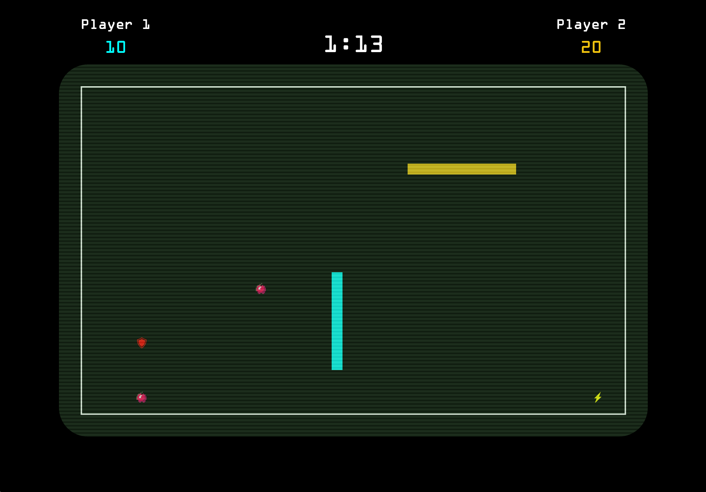

# Xtreme Snake

A 2-player version of the classic game [Snake](https://en.wikipedia.org/wiki/Snake_(video_game)), written in JavaScript.

You can play it [here](http://www.robins.me/Snake).

</img>

## Functionality

Players use the keyboard to control their snake. The aim is to accumulate as many points as possible (by eating apples) before the timer runs out. In 2-player mode, colliding with a wall or snake results in a victory for the opposing player.

There are three power-ups: **lightning** gives the player a temporary speed boost; **shield** allows the player to pass over his or her own snake for a limited amount of time; and **scissors** reduces the length of the player's snake.

## Approach

The game uses no external libraries besides jQuery.

The board is represented by an HTML table. CSS classes are applied to specific cells to display the snakes and other items. The `setTimeout()` method is used to update the game state (move the snakes, check for collisions etc.) at set intervals.

Apples and power-ups are randomly generated.

## Technologies and Resources

* HTML
* CSS
* JavaScript
* jQuery
* Images from [Flaticon](http://www.flaticon.com/)
* Fonts:
  * [Orbitron](https://www.google.com/fonts/specimen/Orbitron)
  * [Play](https://www.google.com/fonts/specimen/Play)
  * OCR-A Extended

## Future plans

* Leaderboard
* Sound effects
* Difficulty selection
* "Survival" mode (no timer)
* Improve item distribution
